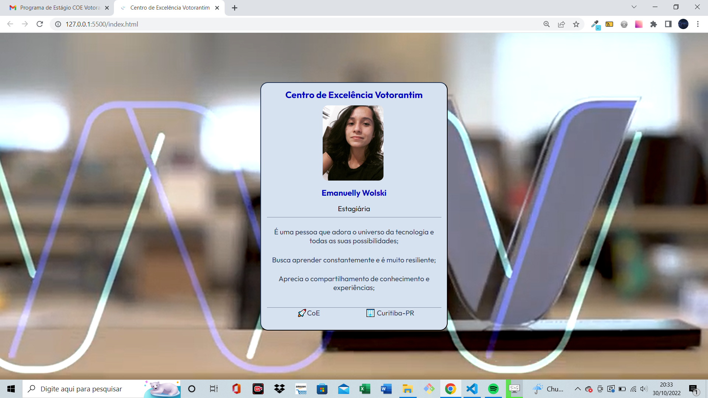

# Desafio 🔎
Neste desafio me empenhei em exercitar minhas habilidades em HTML e CSS para atingir o objetivo proposto pela Votorantim.

## Objetivo 📝

Desenvolver uma aplicação web mais próxima possível de um crachá institucional.

## Conceitos colocados em prática 💻
- Display flex;
- Justify-content;
- Align-items;
- Padding;
- Margin;
- Border;
- Links
- Importação de fontes;
- Criação de variáveis para cores;
- Planejamento e análise da estrutura do projeto;

## Tecnologias utilizadas ⚔

 
    
    
    

## Como testar os comandos ❓

Primeiramente deve-se clonar este repositório no git bash com o comando: git clone url do repositório

Após isso, você terá acesso as pastas com todos os aquivos utilizados para a realização do exercício. Basta abrir a pasta com o VsCode ou seu editor de código específico.

Feito isso, basta seguir os passos a seguir:

1️⃣ Dentro do seu navegador, clicando com o botão direito, escolhendo a opção “Inspecionar” e a aba “Console”. Basta copiar e colar cada uma das linha de código.

2️⃣ Ou se o seu editor de código for o VsCode, dentro arquivo HTML basta utilizar o atalho alt + l + o que através da extensão Live Server irá ser executado os códigos e exibido diretamente no console do seu navegador.

## Vizualização ✨
[]

